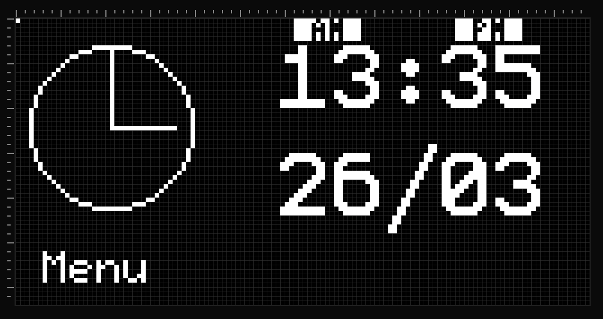

# ESP32-Clock

<!--
## Dannys Favorite Quote

"To give anything less than your best, is to sacrifice the gift."
-Steve Prefontaine

## Jans Favorite Quote

"You miss 100% of the shots you dont take"
-Wayne Gretzky
-Michael Scott
-->

Simple internet-connected clock using an ESP32 (Xiao ESP32 S3), pulling time via NTP, and displaying it on a SH1106 OLED using the U8g2 library.

## Table of Contents

- [The Idea](#the-idea)
- [Installation](#installation)
- [The Xiao ESP32](#the-xiao-esp32)
- [The Screen](#the-screen)
- [The Pinout and Wiring Diagram](#the-pinout-and-wiring-diagram)
- [Display layout and elements](#display-layout-and-elements)

## The Idea

The idea is simple. We want to hook up a microcontroller to the world wide web. Here we will call an API to get the accurate time. This will then be output onto a small screen via an I2C connection.

## Installation

We are using [PlatformIO](https://platformio.org/) as a plugin for VSCode. You could also use the [Arduino IDE](https://www.arduino.cc/en/software/).  
Clone the repository to your local machine.  
Update the Secrets.h file according to your Wifi Connection  
Upload the code to your ESP32 via USB cable  

These are the libraries being used:
- [U8g2](https://github.com/olikraus/u8g2/wiki)
- [WifiManager](https://github.com/aromprg/WiFiManager)

## The Xiao ESP32

We are using the Xiao ESP 32 for this build for several reasons.  
First of all, it's extremely cheap. It usually costs just under 10$ (at the time of writing this at least).  
Also it's widely available. No matter if you check Aliexpress, Amazon or basically any other webshop that sells electronics, they should have it.  
Another important part is the builtin WiFi. So getting it connected is very simple.  
And lastly, it's very small. This makes it easy to implement in small formfactor builds.  

## The Screen

Since we are using the [U8g2](https://github.com/olikraus/u8g2/wiki) library, you could pretty much use any monochrome screen. We decided to go with the cheapest kind.  
Again the reason is they are cheap, readily available and simple to use.  
Ours came with the SH1106 display driver, but even if yours comes with a different one, it's just one line of code that would need to be changed (you simply need to change the initalizing for the display, more on that later).  

**Important**: These screens come in different pinouts. Make sure you connect VCC from the display to 3.3V and GND to GND of the Xiao ESP32. For some of them these are swapped, compared to our wiring diagram!  

  

[128x64 OLED Monochrome Display](https://m.media-amazon.com/images/I/61tDYR1R5ML._AC_SL1440_.jpg)

## The Pinout and Wiring Diagram

We will be using an [I2C](https://en.wikipedia.org/wiki/I%C2%B2C) connection for communication with the screen. For this the GPIO pins 5 and 6 are used (left side, second and third from the bottom). The screen will be powered using 3.3V (right side, third from the top).

[Xiao ESP32 S3 Pinout](https://hubtronics.in/image/catalog/xiao-s3-6.jpg)

  

[Wiring Diagram](https://app.cirkitdesigner.com/project/1110f6d5-ce90-4a6f-82fb-755107a45a04)

## Display layout and elements

The elements which we will display are:
- Time (digital)
- Time (analog)
- Date

The layout was done using a webapp called [Lopaka](https://lopaka.app/). There is a free tier to use, however it's very limited. Most likely though it will be more than enough for doing a project of this size. There is the option to selfhost the app, if you don't want to pay for the premium tier, since it's completely open source. Go check it out!

We decided on this layout, so we would have some space below the data thats being shown, to indicate which buttons do what later down the line.

The month is saved in base zero, meaning we need to get it from the RTC and then add 1 to it, in order for it to be displayed correctly

  
